# K8s Admin

多集群 Kubernetes 管理平台，支持 RBAC 权限控制、资源管理、应用发布、实时终端、审计日志等功能。


## 功能特性

- **多集群管理** - 通过 Token、Kubeconfig 或 EKS Token 连接和管理多个 Kubernetes 集群
- **RBAC 权限控制** - 基于角色的访问控制，支持集群级别和命名空间级别的细粒度权限
- **资源管理** - 管理 Deployments、StatefulSets、DaemonSets、Jobs、Pods、Services、Ingresses、ConfigMaps、Secrets、PVCs 等全部常用资源
- **应用发布** - 基于模板的应用部署，支持版本追踪和回滚
- **实时终端** - 基于 WebSocket 的 Pod 终端，支持交互式 Shell
- **实时日志** - Pod 日志实时流式查看
- **Dashboard** - 集群状态总览、Pod/Deployment 统计、最近事件，按用户权限过滤
- **审计日志** - 全面记录用户操作
- **飞书通知** - 部署/回滚时通过飞书 Webhook 发送通知

## 技术栈

| 类别 | 技术 |
|------|------|
| 前端 | Next.js 16、React 19、Ant Design 5、Zustand、Tailwind CSS 4、xterm.js |
| 后端 | Next.js API Routes、自定义 Server（WebSocket）、Drizzle ORM |
| 数据库 | PostgreSQL |
| 认证 | JWT、邮箱验证码 |
| K8s | @kubernetes/client-node、AWS SDK（EKS Token） |

## 截图

### 登录

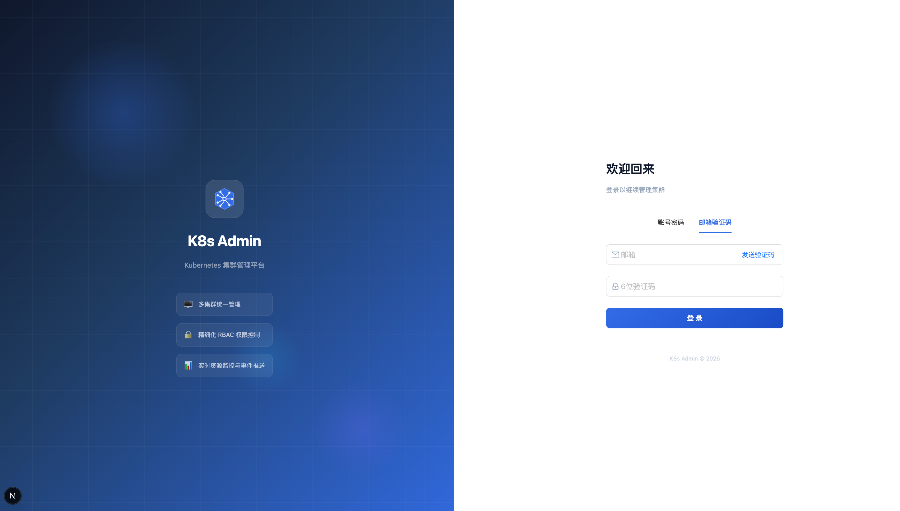

### 集群管理

<table>
  <tr>
    <td></td>
    <td>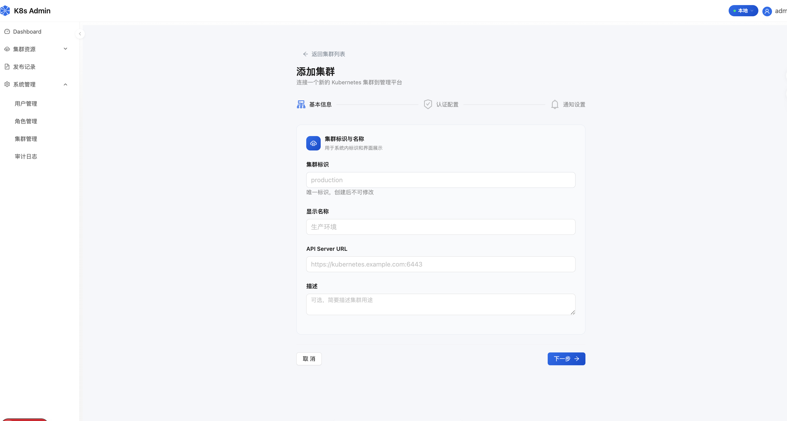</td>
  </tr>
  <tr>
    <td align="center">集群列表</td>
    <td align="center">添加集群</td>
  </tr>
</table>

### 工作负载

<table>
  <tr>
    <td></td>
    <td>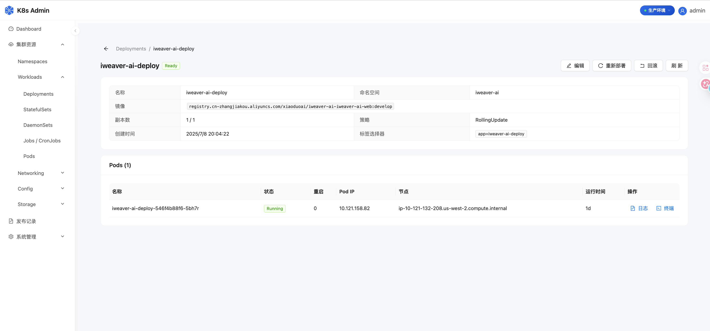</td>
  </tr>
  <tr>
    <td align="center">Deployments</td>
    <td align="center">Deployment 详情</td>
  </tr>
  <tr>
    <td>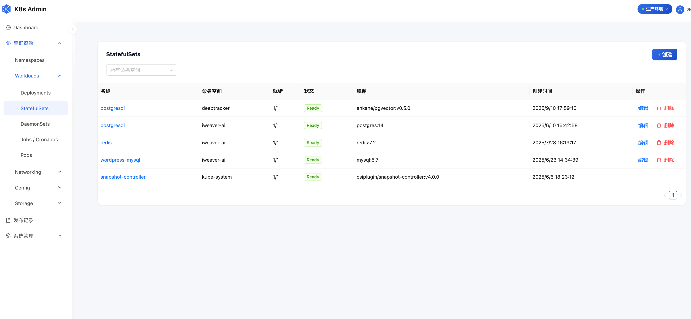</td>
    <td>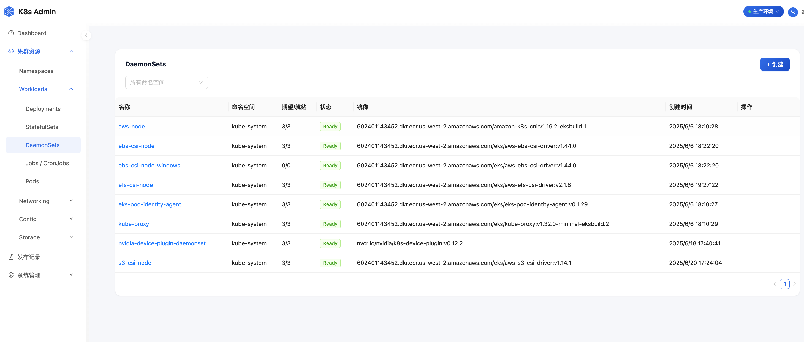</td>
  </tr>
  <tr>
    <td align="center">StatefulSets</td>
    <td align="center">DaemonSets</td>
  </tr>
  <tr>
    <td>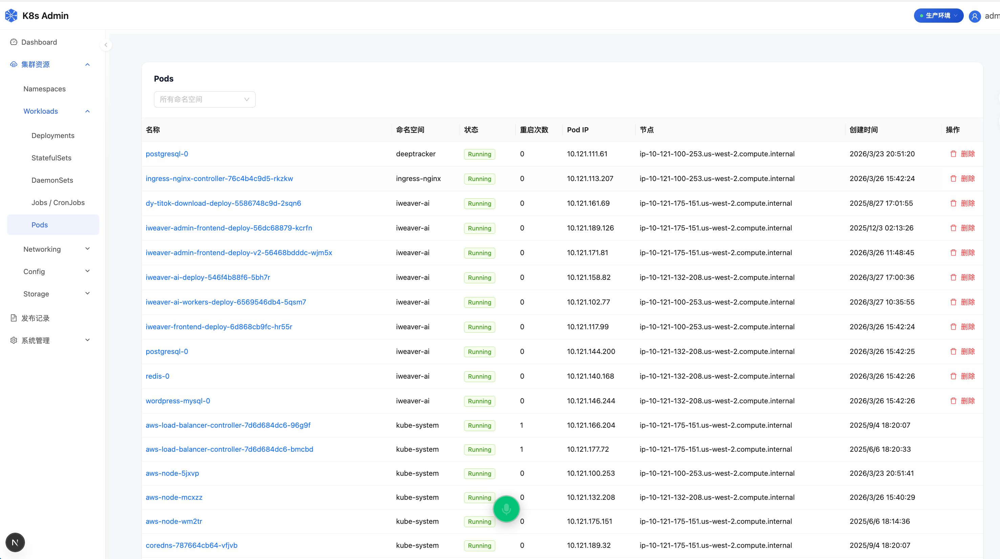</td>
    <td></td>
  </tr>
  <tr>
    <td align="center">Pods</td>
    <td></td>
  </tr>
</table>

### 网络

<table>
  <tr>
    <td></td>
    <td>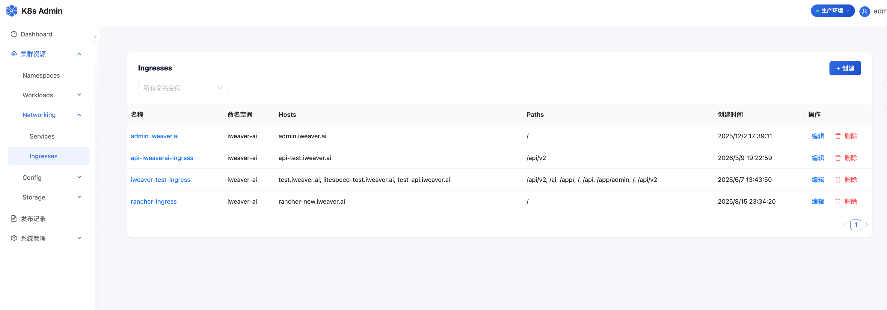</td>
  </tr>
  <tr>
    <td align="center">Services</td>
    <td align="center">Ingresses</td>
  </tr>
</table>

### 配置与存储

<table>
  <tr>
    <td>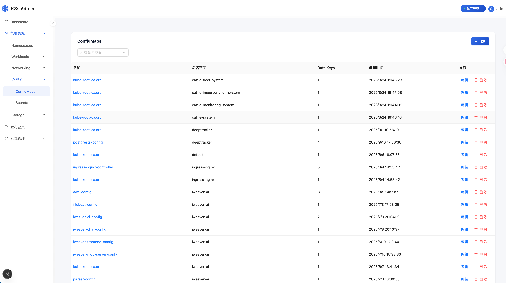</td>
    <td>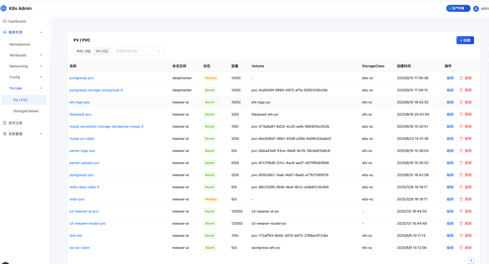</td>
  </tr>
  <tr>
    <td align="center">ConfigMaps</td>
    <td align="center">PersistentVolumeClaims</td>
  </tr>
  <tr>
    <td>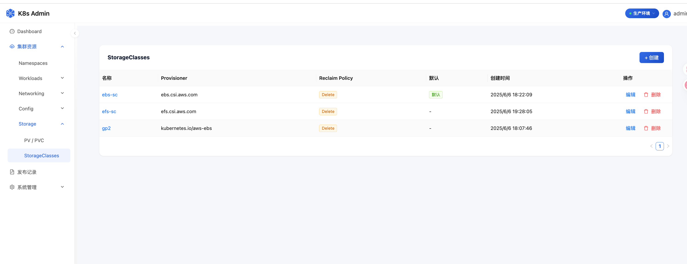</td>
    <td>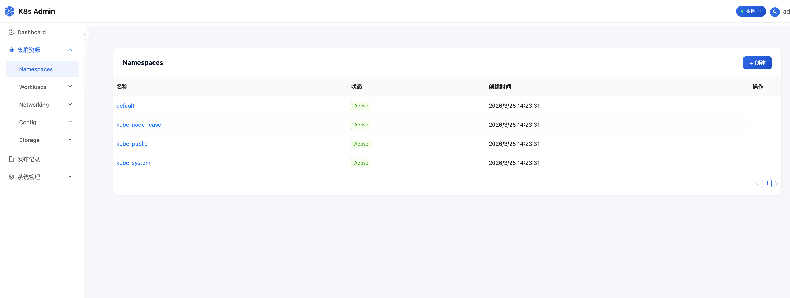</td>
  </tr>
  <tr>
    <td align="center">StorageClasses</td>
    <td align="center">Namespaces</td>
  </tr>
</table>

### 终端与日志

<table>
  <tr>
    <td></td>
    <td></td>
  </tr>
  <tr>
    <td align="center">Pod 终端</td>
    <td align="center">实时日志</td>
  </tr>
</table>

### 资源编辑


### 应用发布

<table>
  <tr>
    <td></td>
    <td></td>
  </tr>
  <tr>
    <td align="center">发布记录</td>
    <td align="center">飞书通知卡片</td>
  </tr>
</table>

### 用户与权限管理

<table>
  <tr>
    <td></td>
    <td>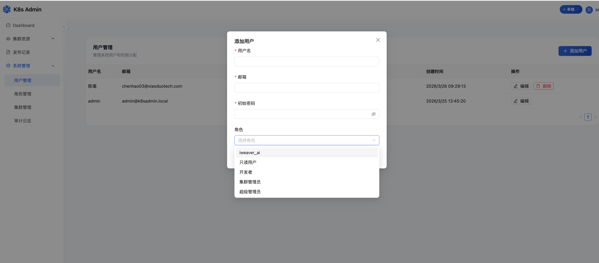</td>
  </tr>
  <tr>
    <td align="center">用户管理</td>
    <td align="center">创建用户</td>
  </tr>
  <tr>
    <td>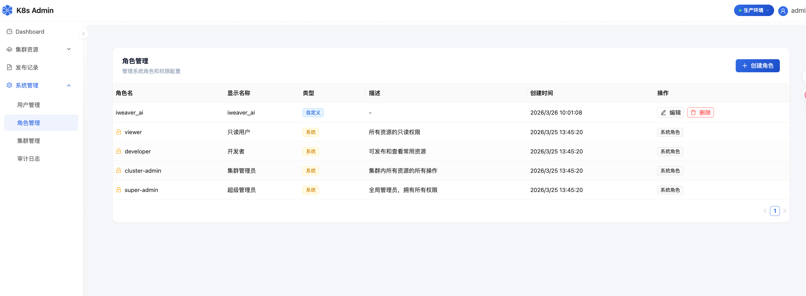</td>
    <td></td>
  </tr>
  <tr>
    <td align="center">角色管理</td>
    <td align="center">角色创建</td>
  </tr>
</table>

### 审计日志


## 快速开始

### 环境要求

- Node.js 20+
- PostgreSQL

### 本地开发

```bash
# 安装依赖
npm install

# 配置环境变量
cp .env.example .env
# 编辑 .env，设置 DATABASE_URL 和 ENCRYPTION_KEY

# 启动开发服务器
npm run dev
```

打开 http://localhost:3000。首次启动时，系统会自动创建数据库、运行迁移并生成管理员账号（密码在控制台输出中查看）。

### Docker 部署

```bash
# 构建镜像
docker build -t twwch/k8s-admin .

# 使用 docker-compose 启动（含 PostgreSQL）
docker compose up -d

# 或使用脚本启动
./docker_run.sh
```

`docker_run.sh` 会挂载 `~/.aws`（只读）和 `.env` 到容器中。

### 环境变量

| 变量 | 说明 | 默认值 |
|------|------|--------|
| `DATABASE_URL` | PostgreSQL 连接字符串 | 必填 |
| `ENCRYPTION_KEY` | 32 字节 hex 密钥，用于加密集群凭据 | 必填 |
| `SESSION_EXPIRY_HOURS` | JWT 会话过期时间（小时） | `24` |
| `SMTP_HOST` | SMTP 服务器（用于邮箱验证码登录） | - |
| `SMTP_PORT` | SMTP 端口 | `587` |
| `SMTP_USER` | SMTP 用户名 | - |
| `SMTP_PASS` | SMTP 密码 | - |
| `SMTP_FROM` | 发件人邮箱 | `noreply@k8sadmin.local` |
| `NEXT_PUBLIC_WS_URL` | WebSocket 地址 | `ws://localhost:3000/ws` |

## 自动初始化

服务启动时会自动执行：

1. **创建数据库** - 如果数据库不存在则自动创建
2. **运行迁移** - 执行 `drizzle/` 下的迁移文件（已有表则跳过）
3. **初始化数据** - 创建内置角色（super-admin、cluster-admin、developer、viewer）和管理员用户（随机密码输出到控制台）

## CI/CD

GitHub Actions 工作流（`.github/workflows/docker-publish.yml`）：

- 推送到 `main` 分支 → 构建并推送 `twwch/k8s-admin:latest`
- 推送 `v*` 标签 → 构建版本镜像并创建 GitHub Release

## 社区支持

- [LINUX DO](https://linux.do/)

## License

[Apache License 2.0](LICENSE)
