# K8s Admin：一个轻量级的多集群 Kubernetes 管理平台

## 背景：我们为什么还需要一个 K8s 管理平台？

2025 年 8 月 1 日，国内最知名的 Kubernetes 管理平台 KubeSphere 突然宣布闭源。官方删除了 Docker 镜像、下架了安装文档、关闭了下载链接，甚至锁定了 GitHub 讨论区——没有任何过渡期。大量在生产环境中使用 KubeSphere 的企业一夜之间被"抛弃"，核心成员当天离职，社区称之为"信任塌方"。

另一边，Rancher 虽然仍在维护，但长期存在的痛点让很多团队望而却步：

- **太重了**。Rancher 自身就是一套复杂系统，对资源消耗大，管理 20+ 集群时 UI 明显卡顿
- **升级是噩梦**。社区频繁反馈：哪怕一次小版本升级都可能导致丢失所有托管集群
- **学习曲线陡峭**。对中小团队来说，Rancher 的功能过于臃肿，很多功能用不上但运维成本降不下来
- **被 SUSE 收购后**，社区投入明显减少，重心转向商业版 Rancher Prime

KubeSphere 闭源、Rancher 过重——对于只需要一个**简单好用的多集群管理界面**的团队来说，选择并不多。这就是我做 K8s Admin 的原因。

## K8s Admin 是什么

K8s Admin 是一个开源的多集群 Kubernetes 管理平台，基于 Next.js 16 和 React 19 构建。它的设计理念是**够用就好**——不做平台的平台，只做一个让你能快速管理多个 K8s 集群的 Web 工具。

GitHub 地址：[https://github.com/twwch/k8s-admin](https://github.com/twwch/k8s-admin)

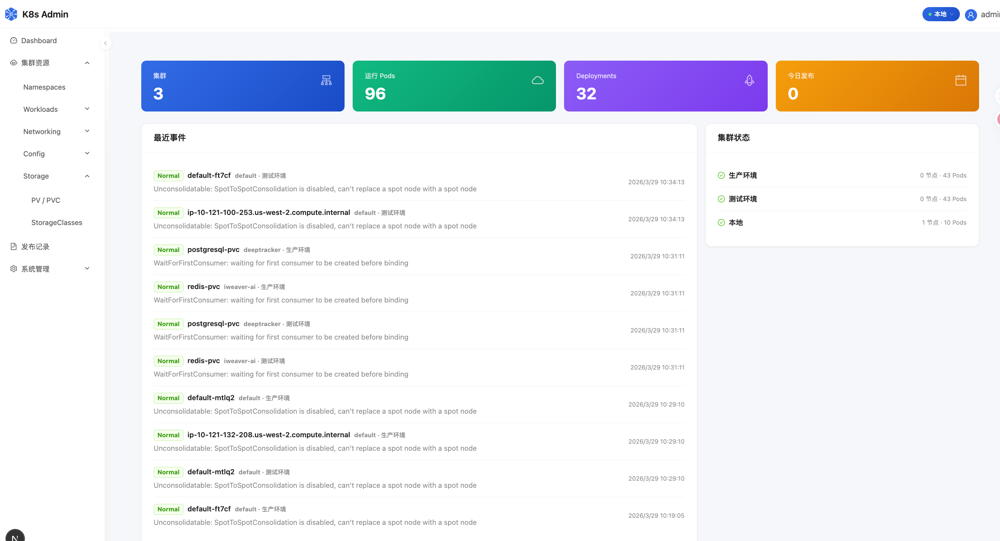

## 核心功能

### 1. 多集群管理

支持通过 Kubeconfig、ServiceAccount Token、EKS Token 三种方式接入集群，一个界面管理所有集群。

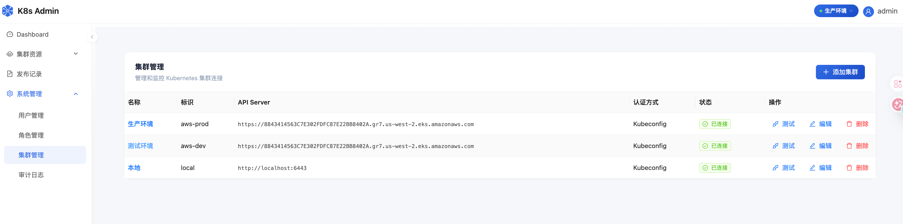

### 2. 完整的资源管理

覆盖日常运维所需的全部 K8s 资源：Deployment、StatefulSet、DaemonSet、Job、Pod、Service、Ingress、ConfigMap、Secret、PVC、StorageClass、Namespace。

支持在线 YAML 编辑，所见即所得。

<table>
  <tr>
    <td>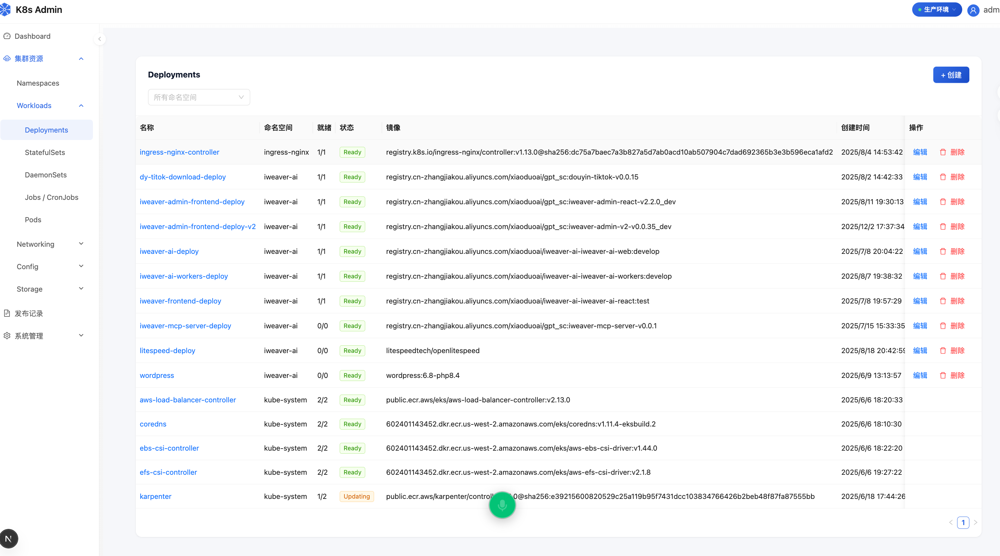</td>
    <td>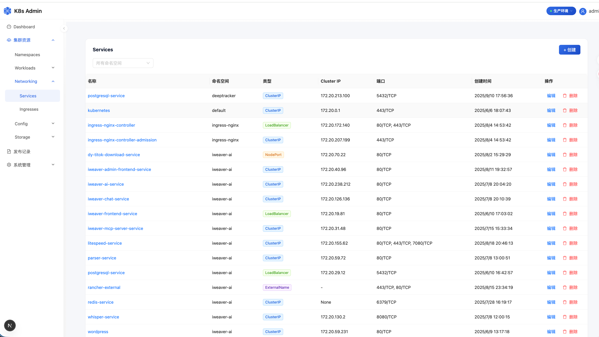</td>
  </tr>
  <tr>
    <td align="center">Deployments</td>
    <td align="center">Services</td>
  </tr>
</table>

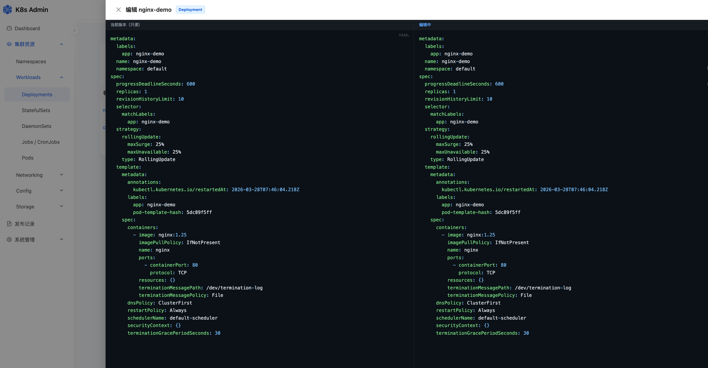

### 3. Pod 终端 & 实时日志

基于 WebSocket + xterm.js 实现的 Pod 终端，直接在浏览器里进入容器 Shell。实时日志流式查看，不用再切到命令行敲 `kubectl logs -f`。

<table>
  <tr>
    <td>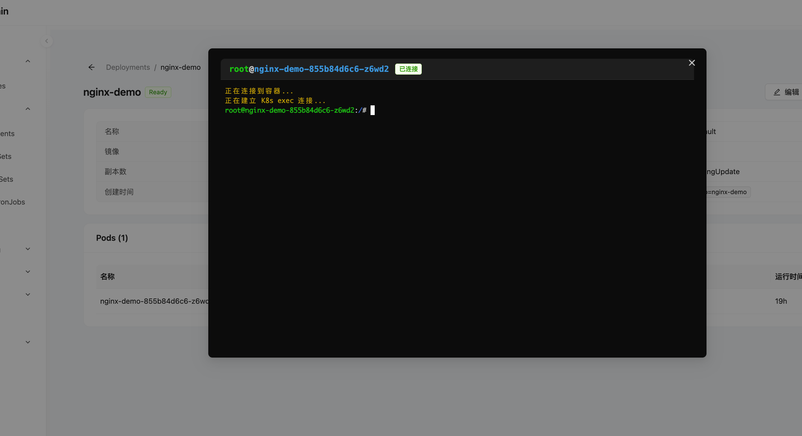</td>
    <td>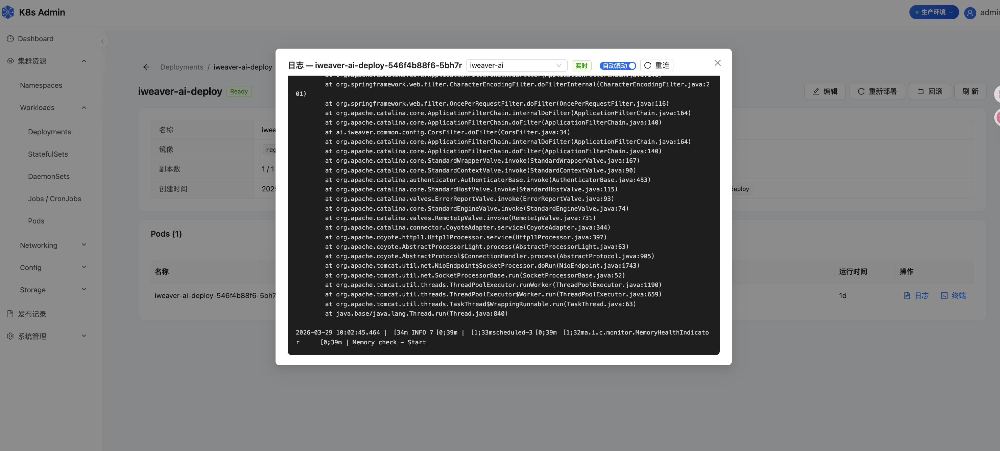</td>
  </tr>
  <tr>
    <td align="center">Pod 终端</td>
    <td align="center">实时日志</td>
  </tr>
</table>

### 4. RBAC 权限控制

内置 super-admin、cluster-admin、developer、viewer 四个角色，支持自定义角色。权限粒度细到**集群 + 命名空间 + 资源类型 + 操作类型**，适合多人协作场景。

<table>
  <tr>
    <td>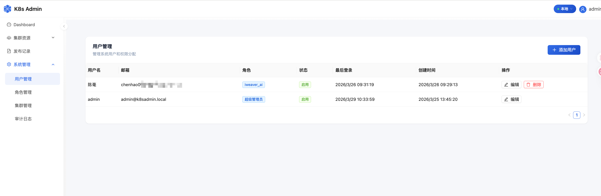</td>
    <td>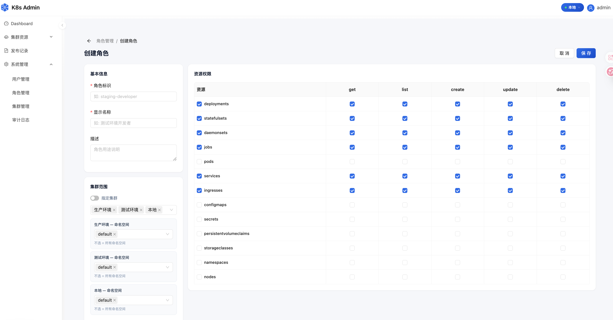</td>
  </tr>
  <tr>
    <td align="center">用户管理</td>
    <td align="center">角色创建</td>
  </tr>
</table>

### 5. 应用发布 & 飞书通知

支持应用发布记录追踪和回滚。部署时自动通过飞书 Webhook 发送通知卡片，方便团队协作。

<table>
  <tr>
    <td>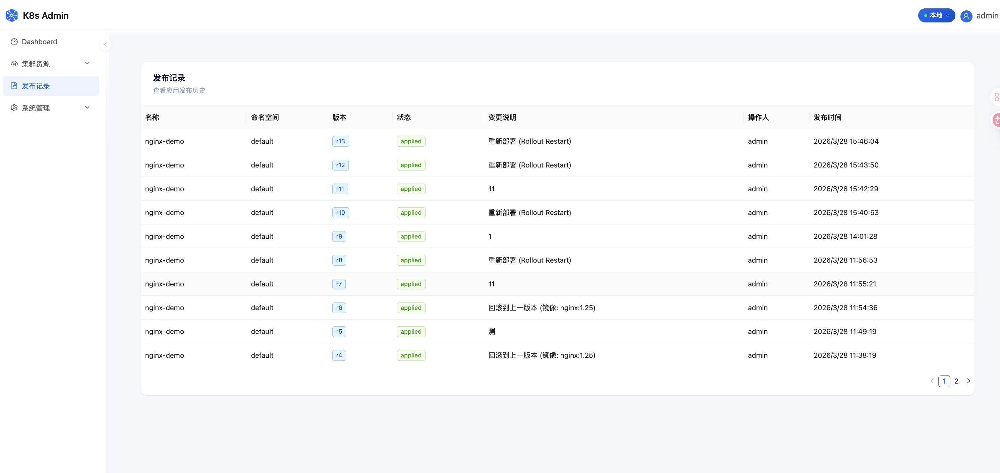</td>
    <td>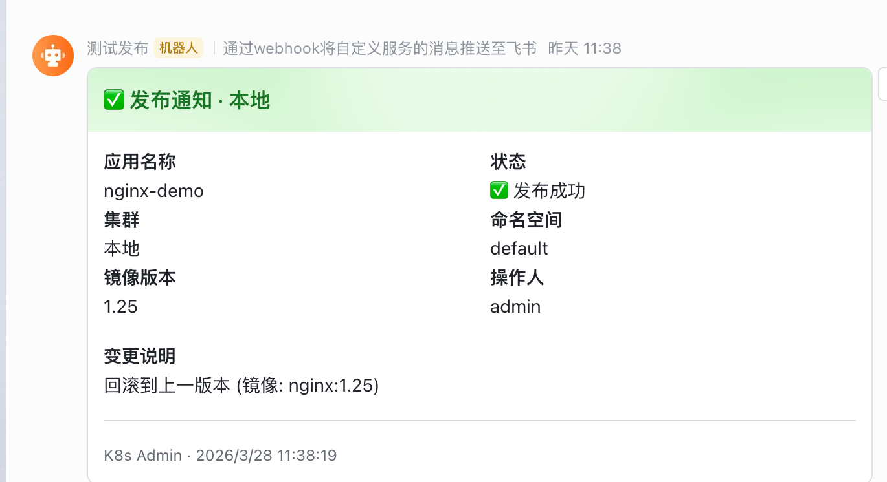</td>
  </tr>
  <tr>
    <td align="center">发布记录</td>
    <td align="center">飞书通知卡片</td>
  </tr>
</table>

### 6. 审计日志

所有操作留痕，记录操作人、IP、时间、动作，满足安全审计需求。

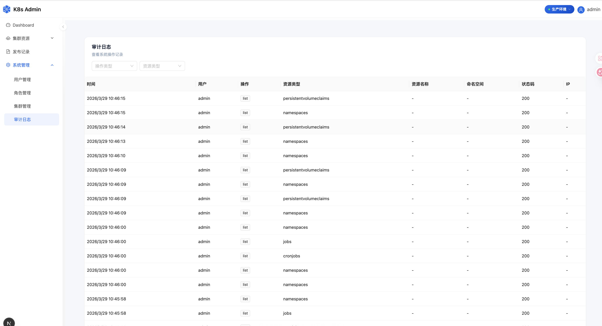

## 技术栈

| 类别 | 技术 |
|------|------|
| 前端 | Next.js 16、React 19、Ant Design 5、Tailwind CSS 4 |
| 后端 | Next.js API Routes、WebSocket Server、Drizzle ORM |
| 数据库 | PostgreSQL |
| 认证 | JWT、邮箱验证码 |

## 快速体验

```bash
git clone https://github.com/twwch/k8s-admin.git
cd k8s-admin
cp .env.example .env
# 编辑 .env，配置 DATABASE_URL 和 ENCRYPTION_KEY
docker compose up -d
```

首次启动自动建库、迁移、创建管理员账号（密码在控制台输出）。也支持 `npm run dev` 本地开发。

## 和其他方案的对比

| | K8s Admin | KubeSphere | Rancher |
|---|---|---|---|
| 开源协议 | Apache 2.0 | 已闭源 | Apache 2.0 |
| 部署复杂度 | 一个容器 + PostgreSQL | 依赖 K8s 集群部署 | 需要独立集群 |
| 资源占用 | 极低（~100MB） | 较高 | 高（建议 4C8G+） |
| 多集群管理 | ✅ | ✅ | ✅ |
| RBAC | ✅ | ✅ | ✅ |
| Pod 终端 | ✅ | ✅ | ✅ |
| 上手难度 | 低 | 中 | 高 |

## 总结

K8s Admin 不打算做一个大而全的平台，它解决的是一个具体的问题：**用最小的成本，让团队能通过 Web 界面管理多个 Kubernetes 集群**。

如果你的团队正在寻找 KubeSphere 的替代方案，或者觉得 Rancher 太重，不妨试试。

- GitHub：[https://github.com/twwch/k8s-admin](https://github.com/twwch/k8s-admin)
- 协议：Apache 2.0

